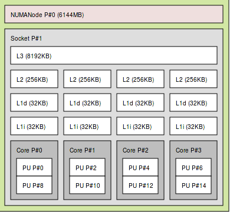
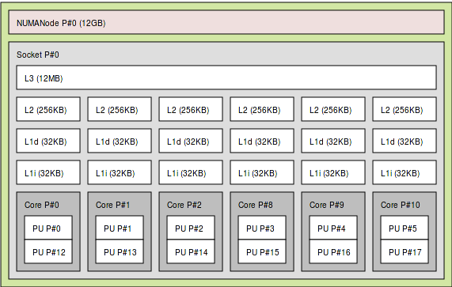
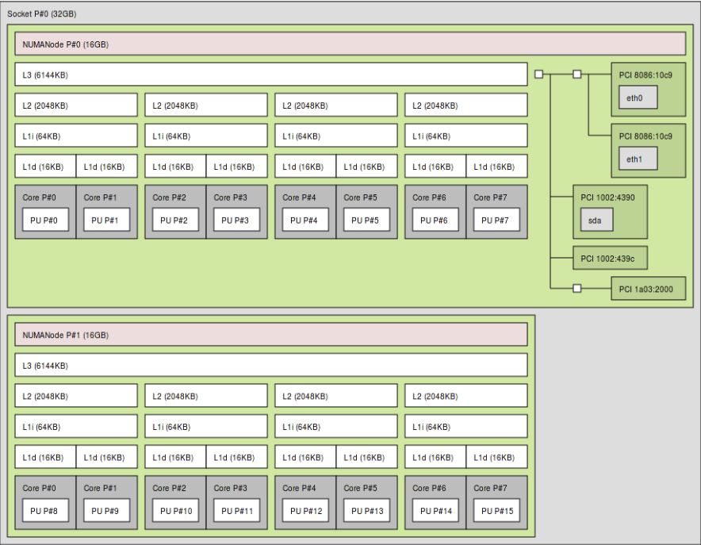

#Table of Contents
<!-- MarkdownTOC -->

- [GreenPlanet Hardware](#greenplanet-hardware)
- [Introduction to Parallel Computing](#introduction-to-parallel-computing)
	- [Terminology](#terminology)
	- [Background](#background)
	- [Examples](#examples)
		- [Pure MPI](#pure-mpi)
		- [Pure OpenMP](#pure-openmp)
		- [Hybrid \(OpenMP + MPI\)](#hybrid-openmp--mpi)
	- [Summary](#summary)
- [Hybrid Parallelization in NAMD](#hybrid-parallelization-in-namd)
	- [Intel Hyper-threaded Processors](#intel-hyper-threaded-processors)
		- [Partition nes2.8 Hardware](#partition-nes28-hardware)
		- [Batch Script Example \(Nehalem\)](#batch-script-example-nehalem)
			- [Optional Flags](#optional-flags)
			- [Batch Script Example \(Westmere\)](#batch-script-example-westmere)
	- [AMD Multi-core Processors](#amd-multi-core-processors)
		- [Partition ilg2.3 Hardware](#partition-ilg23-hardware)
		- [Batch Script Example](#batch-script-example)
			- [Optional Flags](#optional-flags-1)

<!-- /MarkdownTOC -->


#GreenPlanet Hardware

|<sub> Partition</sub>| <sub>CPU Arch </sub>| <sub>Clock Speed </sub>| <sub>Nodes </sub>| <sub>Cores / Node</sub> | <sub>Total Cores </sub>| <sub>Sockets / Node </sub>|<sub> Cores / Socket </sub>| 
|:---------:|:-------------:|:-----------:	|:-----:|:----------:	|:-----------:|:------------:|:------------:|
| <sub>mf_m-c1.9 </sub>	| <sub>AMD (Mangy-Cours) </sub>| <sub>1.9Ghz </sub>	| 10 	| 48 	| 480 	| 4 	| 12 	| 
| <sub>mf_m-c2.2 </sub>	| <sub>AMD (Mangy-Cours) </sub>|<sub> 2.2Ghz </sub>	| 2 	| 48 	| 96 	| 4 	| 12 	| 
| <sub>mf_ilg2.3 </sub>	| <sub>AMD (Interlagos) 6276 </sub>	| <sub>2.3Ghz 	</sub>| 26 	| 64 	| 1664 	| 4 	| 16 	|
| <sub>mf_i-b2.8 </sub>	| <sub>Intel (Ivy-Bridge) E5-2680v2 </sub>	| <sub>2.8Ghz </sub>	| 12 	| 40 	| 480 	| 2 	| 20 	| 
| <sub>mf_nes2.8 </sub>	| <sub>Intel (Nehalem) 5560 </sub>	| <sub>2.8Ghz 	| 109 </sub>	| 16 	| 1774 	| 2 	| 8 	| 
| <sub>mf_nes2.8 </sub>	| <sub>Intel (Westmere) X5660 </sub> |<sub> 2.8Ghz </sub>| 12 	| 24 	| 288 	| 2 	| 12 	|

#Introduction to Parallel Computing
######*Referenced from [StackedOverflow](http://stackoverflow.com/questions/11332018/mpi-vs-openmp-for-a-shared-memory) with additional remarks*
###### Other useful references: [PPT on Hybrid MPI and OpenMP Parallel Programming](http://openmp.org/sc13/HybridPP_Slides.pdf)

##Terminology
* **CPU (Central processing unit):**  The main physical chip that carries out the instructions of the computer program. Many modern CPUs have either multi-core processors or hyper-threading  technology.
* **Core:** A processor core is a single individual unit that can execute computer instructions. Multi-core CPUs means there are multiple cores on a single physical CPU chip. 
* **Thread:** A single stream of a sequence of executable instructions. Hyper-threading indicates that a single core can execute multiple threads.
* **OpenMP (Open Multi-Processing):** is an implementation of multi-threading, whereby parallelization is carried out by execution of a master thread that creates a series of slave threads that can be divided and executed concurrently rather than sequentially. 
* **SMP (Symmetric Multiprocessing):** Also, Shared-Memory and Network-Based Parallelism. This type of parallelization involves multiple identical processors that share a single shared memory pool.
* **MPI (Message Passing Interface):** a type of communication protocol to facilitate and synchronize the passing of data or executable instructions across different nodes/computers.


##Background 
Whether you need or want MPI or OpenMP (or both) heavily depends
the type of application you are running, and whether your problem is mostly
memory-bound or CPU-bound (or both). For our purposes, like running molecular
dynamics simulations of protein-ligand or protein-membrane systems, you will
most likely benefit the most by using a MPI + OpenMP or *hybrid* type of
framework. For simpler cases, like vaccum or solvation simulations of small
molecules, you may get the best performance using strictly an OpenMP or MPI
approach.

There are several factors to consider when trying to decide which framework to utilize:

* Size or complexity of the problem
* Hardware: # of nodes, # of cores, CPU clock speed, and available memory

##Examples
A few examples cases to help you understand what framework to chose from:

###Pure MPI
> You need parallelization because you are running out of memory, e.g. you have a simulation and the problem size is so large that your data does not fit into the memory of a single node anymore. However, the operations you perform on the data are rather fast, so you do not need more computational power.

In this case you probably want to use MPI and start one MPI process on each node, thereby making maximum use of the available memory. The factor to consider here is that there must be a fairly reliable network connection to allow for your MPI processes to  communicate across nodes. Given most nodes on Greenplanet have Infiniband connections, worrying about network communication is usually a non-issue.

###Pure OpenMP
>You usually have small datasets and only want to speed up your application, which is computationally heavy. 

In this case OpenMP should be your framework of choice. Through OpenMP, you can speed up your application by recruiting multiple cores to all work on the same problem. Not all problems will receive a performance boost through parallelization by OpenMP. Generally, your problem must be computationally intensive enough that recruiting more cores can help the process along.

###Hybrid (OpenMP + MPI)
>You want it all. You need more memory, i.e. more computing nodes, but you also want to speed up your calculations as much as possible, i.e. running on more than one core per node.

Now your hardware comes into play. From my personal experience, if you have only a few cores per node (4-8), the performance penalty created by the general overhead of using OpenMP (i.e. starting up the OpenMP threads etc.) is more than the overhead of processor-internal MPI communication (i.e. sending MPI messages between processes that actually share memory and would not need MPI to communicate).
However, if you are working on a machine with more cores per node (16+), it will become necessary to use a hybrid approach, i.e. parallelizing with MPI and OpenMP at the same time. In this case, hybrid parallelization will be necessary to make full use of your computational resources, but it is also the most difficult to code and to maintain.

##Summary
If you have a problem that is small enough to be run on just one node, use OpenMP. If you know that you need more than one node (and thus definitely need MPI), but you favor code readability/effort over performance, use only MPI. If using MPI only does not give you the speedup you would like/require, you have to do it all and go hybrid. 

Since most molecular dynamics problems are fairly computationally intensive and models are generally large (require a fair amount of memory), we will focus on using hybrid parallelization.

#Hybrid Parallelization in NAMD
Now, we will go through two examples of using a hybrid job in NAMD using a Intel based cluster and an AMD based cluster. An important thing to note, NAMD will scale better when we use *fewer* cores per node and distribute the MPI processes across multiple nodes.  Generally, you will always want to setup your job so they achieve the following:

* Each individual OpenMP or Charm task occupies the entire socket.
* Leave one core on each socket open to allow for MPI communication and thread migration
* Distribute the entire job across multiple nodes.

All example scripts will begin with the following code block:An important thing to note, NAMD will scale better when we use *fewer* cores per node and distribute the MPI processes across multiple nodes.
```
#!/bin/bash
#SBATCH --job-name="DTT-mem_DP"
#SBATCH --nodes=2-4
#SBATCH --mem=8gb
#SBATCH --time=00:20:00
#SBATCH --export=ALL

module load namd/2.11-MPISMP
```
Since, all SLURM jobs require these flags, they will be excluded from the code examples below but know they are implicitly part of the entire shell script.
Do note we load a specially compiled version of NAMD, built specifically for this hybrid type of framework (MPI + OpenMP/SMP).

##Intel Hyper-threaded Processors
###Partition nes2.8 Hardware 
|<sub> Partition</sub>| <sub>CPU Arch </sub>| <sub>Clock Speed </sub>| <sub>Nodes </sub>| <sub>Cores / Node</sub> | <sub>Total Cores </sub>| <sub>Sockets / Node </sub>|<sub> Cores / Socket </sub>| 
|:---------:|:-------------:|:-----------:	|:-----:|:----------:	|:-----------:|:------------:|:------------:|
| <sub>mf_nes2.8 </sub>	| <sub>Intel (Nehalem) 5560 </sub>	| <sub>2.8Ghz 	| 109 </sub>	| 16 	| 1774 	| 2 	| 8 	| 
| <sub>mf_nes2.8 </sub>	| <sub>Intel (Westmere) X5660 </sub> |<sub> 2.8Ghz </sub>| 12 	| 24 	| 288 	| 2 	| 12 	|

The `mf_nes2.8` partition actually contains two different CPU chips, shown in the table above.  This will be why we will have two examples for running on the `mf_nes2.8` partition. Particularly, we will sue the `--exclude` flag to ensure SLURM will schedule our job to run on the proper hardware. Otherwise, for example, our 8 core job can be scheduled to run on a 12 core node. This will result in 4 cores sitting idle on a node, thereby wasting potential resources that can be utilized.

If you prefer a visualization of the node topology you can use `lstopo` after ssh-ing into the compute node. Below are screenshots of the output for an individual CPU socket.

**Nehalem:** 

  

Notice, there are *4 physical cores* denoted by `Cores P#0-3` but within each physical core there are actually 2 processing units (PU). This is an Intel feature known as *hyper-threading*. What this allows for is each individual physical core (ie. Core #P0) to execute 2 threads concurrently, allocating 1 thread per processing unit (PU#0 and PU#8), each thread will share the same resources of the single physical core.  Effectively, within each Nehalem processor we have 4(x2) hyper-threaded cores or a total of 8 cores (processing units) per socket. Each Nehalem compute node has 2 sockets (see Hardware table) for a total of 16 cores per node.

**Westmere:**



On the Westmere processors, we have the same topology as the Nehalem processors with the exception of having 6(x2) hyper-threaded cores or a total of 12 cores (processing units) per socket. Each Westmere compute node has 2 sockets for a total of 24 cores per node.

###Batch Script Example (Nehalem)
This particular cluster of nodes in the `mf_nes2.8` partition is probably the partition you want to run most of your complex hybrid jobs on. Simply because there are a total of 109 nodes or 1774 cores, which allows for much better scaling for your job, if necessary.

An example SLURM batch script when trying to run on the `mf_nes2.8` partition are the following:
```
#SBATCH --nodes=4
#SBATCH --partition=mf_nes2.8
#SBATCH --cpus-per-task=8

##SBATCH --ntasks-per-node=2
#SBATCH --exclude="c-3-[341-344], c-6-[231-234], c-8-[251-254]"

cpt=$SLURM_CPUS_PER_TASK
srun --propagate=STACK namd2 ++ppn $((cpt-1)) +isomalloc_sync $fname.inp > $fname.log
```
Notes:

* For now, ignore the `--ntasks-per-node=2` to keep our example simple. Explanation below.
* Charm is just NAMD's parallelization implementation, equivalent to OpenMP.

From above, our job will request 4 nodes with 8 cpus-per-task as denoted by the `#SBATCH` flags.  What this will effectively do is launch the job across 4 nodes (1 Charm SMP task on each node), where each task will have a total of 8 cores per task. We specify **8 cpus-per-task** as we want each individual Charm SMP task to occupy the entire socket. This will minimize MPI communication between nodes until data synchronization is required, as each individual task will utilize the each socket's memory pool.

For this particular job, a total of 32 cores is requested. NAMD itself will use a total of 28 cores, specified through the command `namd2 ++ppn $((cpt-1))` which will launch NAMD with 7 cores per node across 4 nodes. We do this to allow for 1 core on each node to be used for MPI communication between the different nodes or allow for thread migration. 

####Optional Flags
To get better performance boost, we can utilize both sockets on the physical compute node by using the `#SBATCH --ntasks-per-node=2` flag. The reason I have commented out this flag is that you may not *always* get a performance boost, it is generally better to distribute the job across more nodes as when multiple tasks share a single compute node bottlenecks can occur in network communications or I/O. 
In my experience, I generally get better performance using at most 2 tasks per node but anything more will get *slightly* worse performance (as in the case of running on the mf_ilg2.3 partition which has 4 sockets).

Here, we explicitly exclude the compute nodes that contain the Westmere processors using the `--exclude` flag. This is fairly important as we want to ensure our job is utilizing all the available resources, rather than letting cores sit idle.

The other flags in the `srun` command are for other slight performance tweaks that have to do with allowing for the maximum amount of memory to be passed across the different compute nodes (`--propogate=STACK`) and to tell NAMD to try to synchronize our data in the memory pool (`+isomalloc_sync`).

####Batch Script Example (Westmere)
In order to run on the Westmere processors, simply change the flags to correspond to the proper CPU count and exclude the Nehalem compute nodes:
```
#SBATCH --nodes=4
#SBATCH --partition=mf_nes2.8
# SBATCH --cpus-per-task=12
##SBATCH --ntasks-per-node=2
# SBATCH --exclude="c-4-[3-20], c-5-[9-42], c-6-[27-30], c-7-[7-24], c-8-[16-24,27,28,31,32,35,36,39,40]"
```

##AMD Multi-core Processors
###Partition ilg2.3 Hardware
|<sub> Partition</sub>| <sub>CPU Arch </sub>| <sub>Clock Speed </sub>| <sub>Nodes </sub>| <sub>Cores / Node</sub> | <sub>Total Cores </sub>| <sub>Sockets / Node </sub>|<sub> Cores / Socket </sub>| 
|:---------:|:-------------:|:-----------:	|:-----:|:----------:	|:-----------:|:------------:|:------------:|
| <sub>mf_ilg2.3 </sub>	| <sub>AMD (Interlagos) 6276 </sub>	| <sub>2.3Ghz 	</sub>| 26 	| 64 	| 1664 	| 4 	| 16 	|

  

AMD processors behave slightly differently than Intel processors, which can be seen (above) by how the cores are mapped out differently. This architecture is sometimes referred to as Clustered Integer Cores or AMD refers to them as "modules". Here, there are a total of 16 cores or 8(x2) "modules" within each processor chip. 

To try to clarify the differences between the architectures:

* Intel Nehalem processors that feature cores that can execute two *virtual* simultaneous threads on a single physical core. 
* AMD Intelagos processors have 2 "modules" that are each single threaded within a single physical core. 

The details of AMD vs Intel architectures are likely not important for this discussion, but the important part to notice is that the individual cores or PUs are numbered/mapped out different. For example, 1 physical Intel Nehalem CoreP#0 contains PU#0 and PU#8. On the other hand, AMD processors has Core#P0 containing PU#0 and shares and the L2 cache with Core#P1 which contains PU#P1. Essentially, the numbering of cores on Intel processors follow a round-robin numbering scheme, whereas AMD processors follow a sequential numbering scheme (0,1,2...). This is why we must introduce the `--distribution=block:block` flag in the Batch script below.

###Batch Script Example
Example SLURM batch script for this partition:
```bash
#SBATCH --nodes=4
#SBATCH --partition=mf_ilg2.3
#SBATCH --cpus-per-task=16
#SBATCH --distribution=block:block
##SBATCH --ntasks-per-node=4

# Exclude poorly mapped node
#SBATCH --exclude="c-16-24" 

cpt=$SLURM_CPUS_PER_TASK
srun --propagate=STACK namd2 ++ppn $((cpt-1)) +isomalloc_sync $fname.inp > $fname.log
```
After using the `--distribution=block:block` flag to account for the different numbering scheme, the same general idea of task distribution follows in that we want each Charm SMP task distributed in a manner that utilizes the entire available memory pool on each socket. 

We can easily achieve this with the `--cpus-per-task=16` flag, considering that cores PU#0-15 reside on a single socket. With our job requesting 4 nodes and if we leave `--ntasks-per-node=4` commented out or specify 1 task per node, we will get a total of 64 cores for this job (16 cores x 4 nodes).

####Optional Flags
You can opt to run a 64-core job on 1 node by using the `--ntasks-per-node=4` flag, since this essentially boils down to a pure MP job, but you will generally get poorer performance. As mentioned previously, it is generally better to distribute your job across multiple compute nodes and running fewer cores on each compute node. In my experience, it's best to use 2 tasks per node. 

You may notice that each AMD socket is further subdivided into 2 so-called `NUMANodes`. Without getting into an explanation of NUMANodes, simply note that on the Intel Nehalem processors the map is 1 socket:1 NUMANode, while AMD processors map 1 socket:2 NUMANodes. What this means is that when a single task requesting 16 cores (like the example above) is allocated to cores PU#0-15, MPI communication occurs between the NUMAnodes. Since the the NUMANodes reside on the same socket, this extra layer of communication likely does not impact performance. In theory though, you can further divide your Charm SMP tasks across the NUMANodes.

Note: We exclude compute node `c-16-24` as this node has issues where not all cores are tied to a NUMANode. This messes with task/thread distribution and thus its easier to just exclude it.
